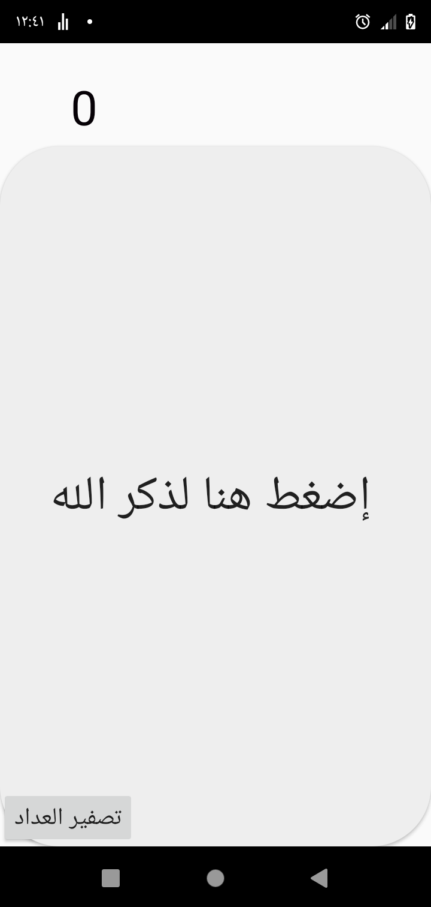
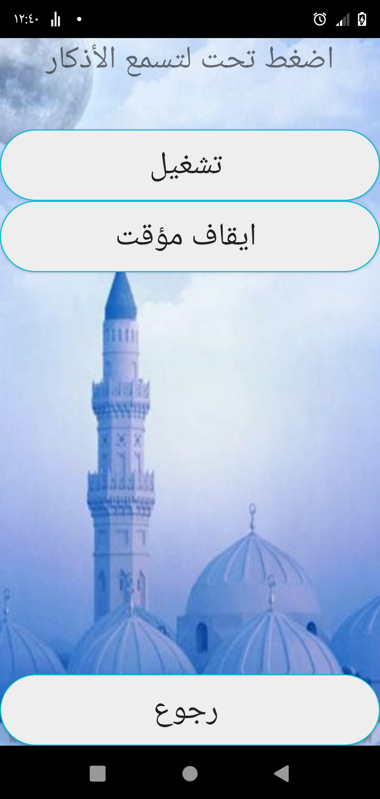
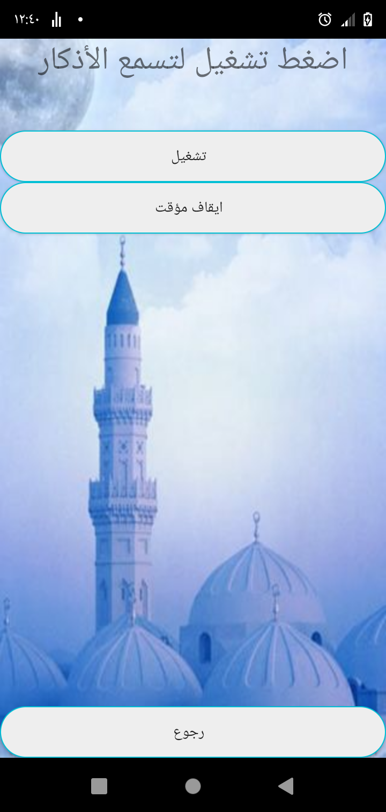

# 📱 Android Athkar App (2016 - 2017)

A native Android application developed using **Java** and **Android Studio**. This app serves as a digital companion for Muslims, displaying daily Islamic Azkar (Remembrances) and Supplications in an organized, user-friendly interface.

---

### 🛠️ Technologies Used
* **Language:** Java
* **IDE:** Android Studio
* **Database:** SQLite (Internal Storage)

---

### 📸 Application Screenshots

Here are the screenshots showcasing the application's interface and design:

  
  
  
  

 

  
  
  
  

